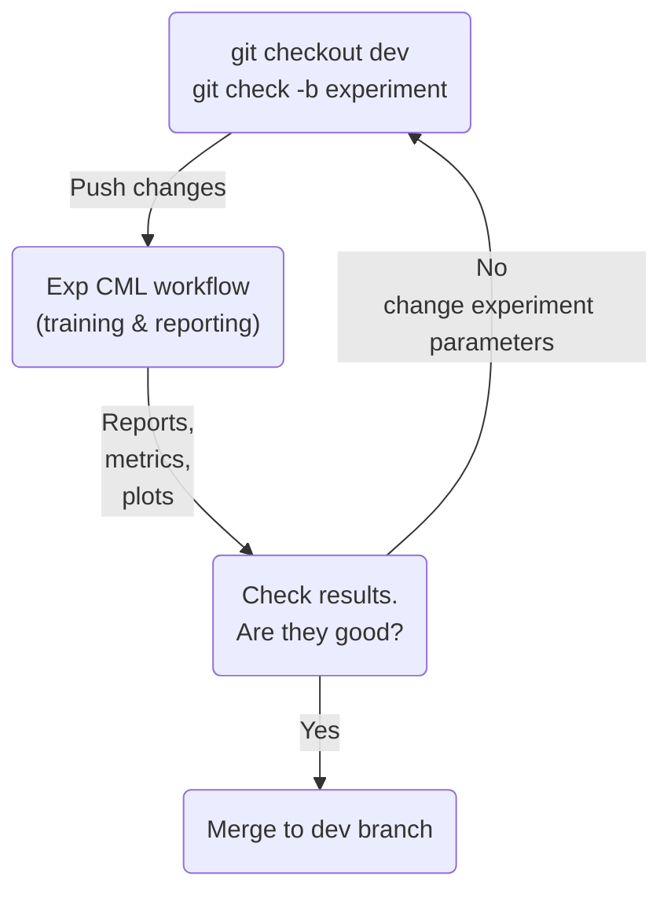
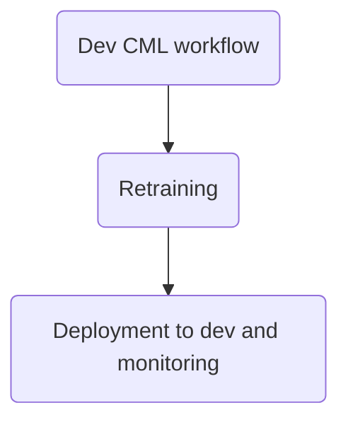
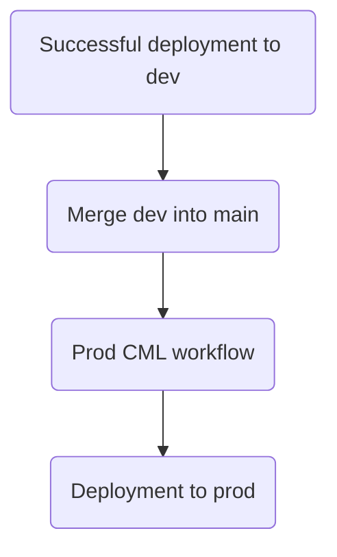

# Saliency defect detection of magnetic tiles

See the blog post at https://dvc.org/blog/end-to-end-computer-vision-api-part-1-data-versioning-and-ml-pipelines for a full explanation.

### This project contains two components:
1. training of image segmentation model using DVC pipelines
2. web API that calls the above model on a provided image and responds with a binary segmentation mask

### The dataset is desribed in detail here: 
https://www.researchgate.net/profile/Congying-Qiu/publication/327701995_Saliency_defect_detection_of_magnetic_tiles/links/5b9fd1bd45851574f7d25019/Saliency-defect-detection-of-magnetic-tiles.pdf


### The dataset itself is hosted in this repository:
[https://github.com/abin24/Magnetic-tile-defect-datasets.](https://github.com/abin24/Magnetic-tile-defect-datasets.)

## CML-based workflows in GitHub Actions
For instruction on how to runs things locally, see the "Local development setup" section below.

### 1. Experimentation phase

[workflow file](.github/workflows/1-experiment.yaml)

In this stage, we'll be performing all our model experiments: work on data preprocessing, change model architecture, tune hyperparameters, etc.
Once we think our experiment is ready to be run, we'll push our changes to a remote repository (in this case, GitHub). This push will trigger a CI/CD job in GitHub Actions, which in turn will:
1. provision an EC2 virtual machine with a GPU in AWS
2. deploy our experiment branch to this machine
3. rerun the entire DVC pipeline 
4. push files with metrics and other DVC artifacts back to GitHub

*Note: the workflow is set up so that GitHub Actions will overwrite git history, thus in order to sync our local workspace with the remote we'll run the `git fetch` command followed by the `git reset --hard @{upstream}` command.
Here we don't run `git pull` as it will result in merging the upstream into our local git history.

At this point, we can assess the results in DVC Studio and GitHub and decide what things we want to change next.



### 2. Deployment to the development environment

[workflow file](.github/workflows/2-develop.yaml)

Once we are happy with our model's performance on the experiment branch, we can merge it into the dev branch.
This would trigger a different CI/CD job that will:
1. retrain the model with the new parameters
2. deploy the web REST API application (that relies on the new/retrained model) to a development endpoint on Heroku

*Note: the workflow is set up so that GitHub Actions will overwrite git history, thus in order to sync our local workspace with the remote we'll run the `git fetch` command followed by the `git reset --hard @{upstream}` command.
Here we don't run `git pull` as it will result in merging the upstream into our local git history.

Now we can test our API and assess the end-to-end performance of the overall solution.



### 3. Deployment to the production environment

[workflow file](.github/workflows/3-deploy.yaml)

If we've thoroughly tested and monitored our dev web API, we can merge the development branch in the main branch of our repository.
Again, this triggers the 3rd CI/CD workflow that deploys the code from the main branch to the production API.




## Local development setup

### Prerequisites
- pipenv
### Setup
```bash
pipenv shell
pipenv install
```

### Remote storage

AWS S3 is our remote storage configured in the [.dvc/config](https://github.com/iterative/magnetic-tiles-defect/blob/main/.dvc/config) file. 
You need to edit this file to configure your own. Many different remote storage types are supported including all major cloud providers. For more info see the [docs](https://dvc.org/doc/command-reference/remote/add).

### Model Training
```bash
dvc repro
```

The model will be saved in the `models/` directory.

Here's the DAG of the pipeline:
```
$ dvc dag
                               +----------------+                         
                               | check_packages |                         
                          *****+----------------+*****                    
                     *****        *          **       ******              
               ******          ***             **           *****         
            ***               *                  **              ******   
+-----------+               **                     *                   ***
| data_load |             **                       *                     *
+-----------+           **                         *                     *
           ***        **                           *                     *
              *     **                             *                     *
               **  *                               *                     *
          +------------+                           *                     *
          | data_split |***                        *                     *
          +------------+   *****                   *                     *
                  *             *******            *                     *
                  *                    *****       *                     *
                  *                         ****   *                     *
                  **                          +-------+                ***
                    ****                      | train |          ******   
                        ****                  +-------+     *****         
                            ***              **       ******              
                               ****        **   ******                    
                                   **     *  ***                          
                                  +----------+                            
                                  | evaluate |                            
                                  +----------+
```             

### Web API serving (local)
```bash
uvicorn app.main:app
```

### Web API serving (Docker)
Build image
```bash
docker build . -t mag-tiles
```

Run container
```bash
docker run -p 8000:8000 -e PORT=8000 mag-tiles
```

### Test API 

*only POST method is supported, i.e. opening a link in a browser (GET method) will return a `"Method Not Allowed"` response.

With `curl`
```bash
curl -X POST -F 'image=@data/MAGNETIC_TILE_SURFACE_DEFECTS/test_images/<image_name>.jpg' -v http://127.0.0.1:8000/analyze
```

With python
```python
import json
from pathlib import Path

import matplotlib.cm as cm
import matplotlib.pyplot as plt
import numpy as np
import requests

url = 'http://127.0.0.1:8000/analyze'
file_path = Path(
    'data/MAGNETIC_TILE_SURFACE_DEFECTS/test_images/<image_name>.jpg')
files = {'image': (str(file_path), open(file_path, 'rb'), "image/jpeg")}
response = requests.post(url, files=files)
data = json.loads(response.content)
pred = np.array(data['pred'])
plt.imsave(f'{file_path.stem}_mask.png', pred, cmap=cm.gray)
```

### Manual deployment to Heroku

```bash
heroku container:login
heroku create <APP_NAME>
heroku container:push web --app <APP_NAME>
heroku container:release web --app <APP_NAME>
```

Currently, the dev version of the app is deployed to https://demo-api-mag-tiles-dev.herokuapp.com/analyze
