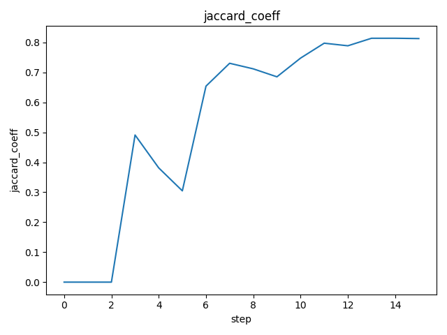
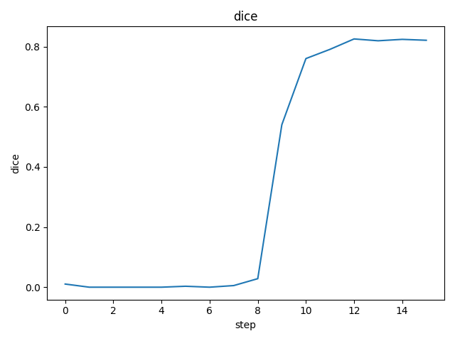
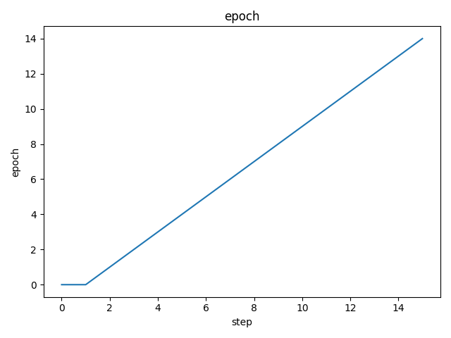
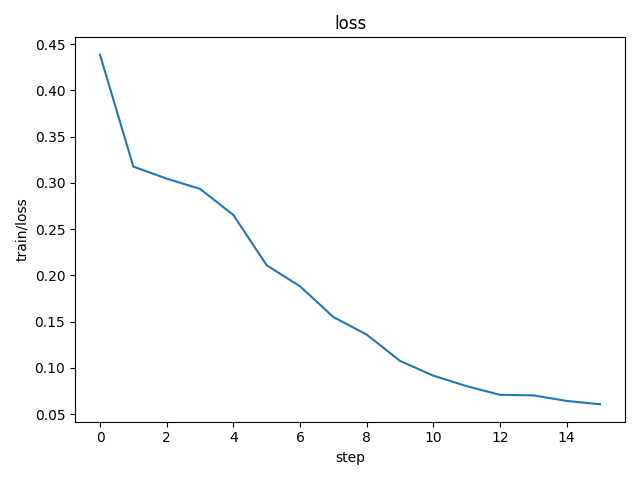
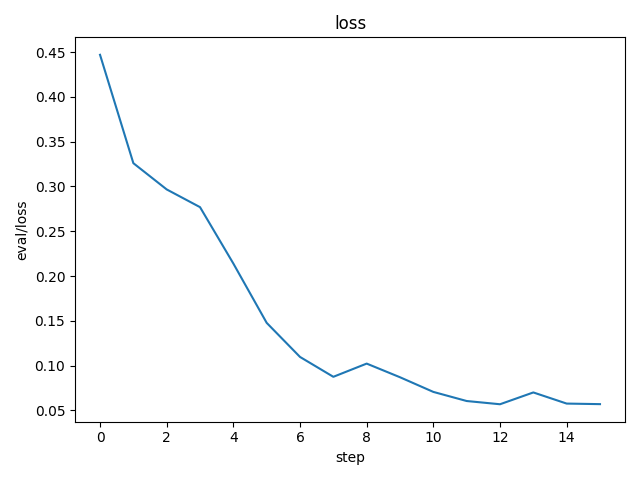

# DVC Report

dvclive-metrics.json

|   step |   epoch | train                         | eval                          |     dice |   jaccard_coeff |
|--------|---------|-------------------------------|-------------------------------|----------|-----------------|
|     15 |      14 | {'loss': 0.07871799916028976} | {'loss': 0.10776636004447937} | 0.821148 |        0.696565 |

dvclive-metrics.json

|   step |   epoch | train                         | eval                          |     dice |   jaccard_coeff |
|--------|---------|-------------------------------|-------------------------------|----------|-----------------|
|     15 |      14 | {'loss': 0.07871799916028976} | {'loss': 0.10776636004447937} | 0.821148 |        0.696565 |
